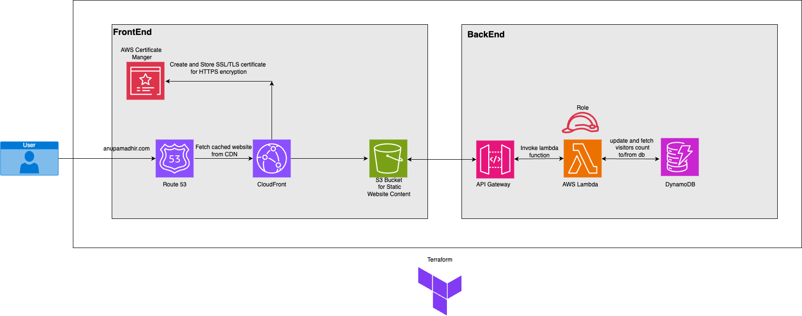
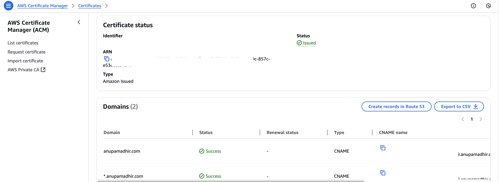
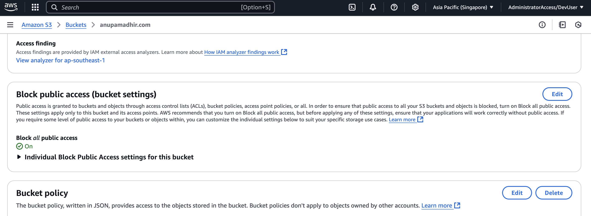
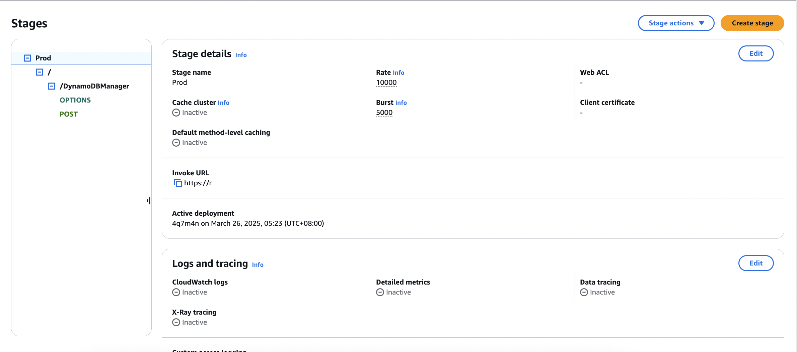
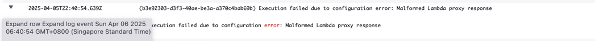

# Cloud Resume Challenge

### Overview  

Create a cloud-hosted resume as the frontend of the application. You can find my [resume](https://anupamadhir.com) here.
I used HTML and CSS to build a responsive web page and hosted it in an S3 bucket as a static website behind a CloudFront(CDN) distribution.
I bought the domain name from Namecheap and used Amazon Certificate Manager to generate an SSL certificate to enable https on my website.
I setup Amazon Route 53 as the DNS provider and setup the alias records to point to the CloudFront Distribution.I have setup CloudFront cache invalidation.  

## Features

Website Hosting: A resume website hosted in an S3 bucket and distributed globally through CloudFront with Origin Access Control (OAC).
Custom Domain: Route 53 manages domain name configurations.
Visitor Tracking: Tracks website visitors using a serverless backend with REST API Gateway, Lambda, and DynamoDB.
Infrastructure as Code: Utilizes Terraform to provision and manage AWS resources.  

## Project Architecture

## Project Structure:

    .
    ├── README.md
    ├── frontend
    │   ├── index2.html
    │   ├── index2.js
    │   └── style2.css
    ├── terraform
    │   ├── main.tf
    │   ├── modules
    │   │   ├── backend
    │   │   │   ├── apigateway.tf
    │   │   │   ├── dynamodb.tf
    │   │   │   ├── lambda
    │   │   │   │   ├── lambda_function.py
    │   │   │   │   ├── lambda_function.zip
    │   │   │   │   ├── update_count.py
    │   │   │   │   └── update_count.zip
    │   │   │   └── lambda.tf
    │   │   └── frontend
    │   │       ├── bucketpolicy.tf
    │   │       ├── cloudfront.tf
    │   │       ├── s3.tf
    │   │       ├── dns.tf
    │   │       └── variables.tf
 
    7 directories, 19 files

### Explanation of Directories and Files:

**frontend/**: Contains the website files  
    - index2.html: Main HTML file for the website  
    - script2.js: Javascript file for interacting with API  
    - style2.css: Stylesheet for website  
**terraform/**: Contains Terraform configuration files for provisioning AWS resources.  
    - main.tf: Contains the main set of configuration for the modules. It also contains the AWS provider settings.
    - modules/:
        - backend/: Provisions REST API Gateway, DynamoDB, and Lambda for visitor tracking. The Lambda function updates and fetches visitor counts from the DynamoDB table.  
        - frontend/: Provisions S3, CloudFront, Cloudfront cloud invalidation and Route 53 for website hosting and DNS management.

    
    

### Certificate Manager:
Request a public Certificate in the N. Virginia Region for anupamadhir.com
and add the subdomains.

Issued Certificate

### S3 Bucket:
Created 2 Buckets. The files are uploaded to anupamadhir.com and www.anupamadhir.com redirects request to anupamadhir.com bucket.
 

 

#### Under Bucket Permissions turned on Block public access

 

#### Enabled static website hosting for bucket

_Route 53 → Cloudfront → Certificate Manager → S3 bucket_

## Week 2 Challenge

### Backend Infrastructure  

The resume website should show the number of views. I wrote a lambda function in Python to update and fetch the number of views.  

The application flow upto this point is:  

_Lambda -> DynamoDB_  

### Connecting Frontend to Backend  

To update the views in the website, we need to connect the frontend to the backend infrastructure.  
I created and deployed a REST API using API Gateway for this purpose and added a javascript to the website to get the views using the API Gateway.
I spent a considerable amount of time getting the javascript to communicate with DynamoDB via the API Gateway. I resolved this issue by enabling CORS on API Gateway.

The application flow upto this point is:  

_Route 53 → Cloudfront → Certificate Manager → S3 bucket → API Gateway →Lambda → DynamoDB_

## Week 3 Challenge

I terraformed my Cloud Resume Challenge. 
Terraform is an Infrastructure-as-Code(IAC) tool which I used to provision the AWS resources used in my website. I used frontend and backend modules to logically group my resources.  
This was a totally new area for me and I encountered issues running Terraform apply which I fixed by using iamadmin user since using an assumed role was the cause root cause of the problem.  
I also got errors since I needed to stringify the json response from the lambda function since I used Lambda Proxy integration in the API Gateway.

